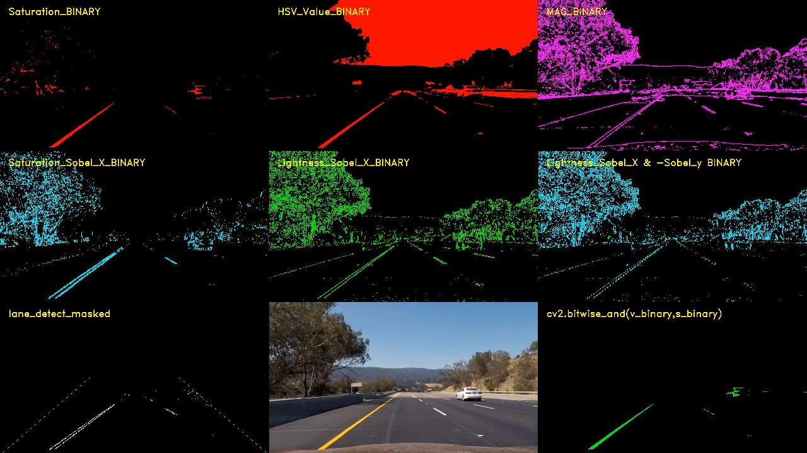
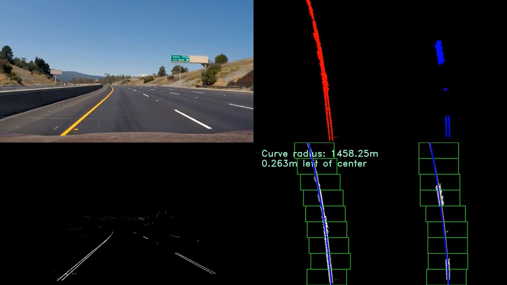
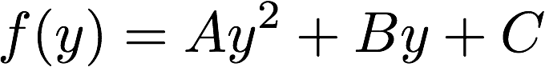
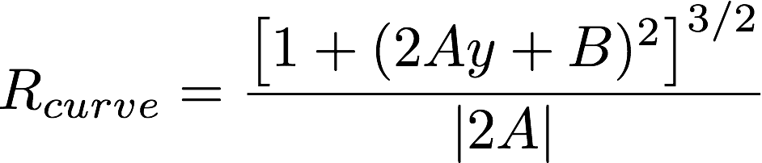

# Writeup

---

**Advanced Lane Finding Project**

The goals / steps of this project are the following:

* Compute the camera calibration matrix and distortion coefficients given a set of chessboard images.
* Apply a distortion correction to raw images.
* Use color transforms, gradients, etc., to create a thresholded binary image.
* Apply a perspective transform to rectify binary image ("birds-eye view").
* Detect lane pixels and fit to find the lane boundary.
* Determine the curvature of the lane and vehicle position with respect to center.
* Warp the detected lane boundaries back onto the original image.
* Output visual display of the lane boundaries and numerical estimation of lane curvature and vehicle position.

[//]: # (Image References)

[image1]: ./Writeup_images/undistort.png "Undistorted"
[image2]: ./Writeup_images/Undistorted2.png "Undistorted_road_image"
[image3]: ./Writeup_images/FilterResult.jpg "FilterResult"
[image4]: ./Writeup_images/LaneDetection.jpg "LaneDetection"
[image5]: ./Writeup_images/Warp.png "Warp"
[image6]: ./Writeup_images/R_equation_A_B_coef.png "R_equation_A_B_coef"
[image7]: ./Writeup_images/f_y_equation.png "f_y_equation"
[image8]: ./output_images/test_result3.jpg "test_result3"
[image9]: ./Writeup_images/Binary.png "Binary"


## [Rubric](https://review.udacity.com/#!/rubrics/571/view) Points

### Here I will consider the rubric points individually and describe how I addressed each point in my implementation.  

---

### Camera Calibration

#### 1. Computing the camera matrix and distortion coefficients. 

The code for this step is contained in the first two code cells of the IPython notebook located in "./Lane_Detection.ipynb". 
The camera calibration step is aimed to remove the image distortion from the camera. In order to calibrate the camera, several checkborad images taken by the same camera are placed in the folder `./cameral_cal/`.

I start by preparing "object points", which will be the (x, y, z) coordinates of the chessboard corners in the world and "image points", which are detected by `cv2.findChessboardCorners` function.
```
ret, corners = cv2.findChessboardCorners(gray, (9,6),None)
```


I then used the `cv2.calibrateCamera()` function and `objpoints` and `imgpoints` to compute the camera calibration and distortion coefficients. I applied this distortion correction to the checkboard image using the `cv2.undistort()` function and obtained this result: 

![alt text][image1]

### Pipeline (single images)

#### 1. Distortion Correction.

To demonstrate this step, I will describe how I apply the distortion correction to one of the test images like this one:

![alt text][image2]
```
ret, mtx, dist, rvecs, tvecs = cv2.calibrateCamera(objpoints, imgpoints, img.shape[1::-1],None,None)
undist = cv2.undistort(img, mtx, dist, None, mtx)
```
`cv2.calibrateCamera()` takes the object points and image points and returns the dist and mtx parameters for camera calibration. With the calibration parameters `cv2.undistort()` function output the corrected images.


#### 2. Using color transforms, gradients or other methods to create a thresholded binary image. 

I used a combination of color and gradient thresholds to generate a binary image (thresholding steps in code cell 145 in "./Lane_Detection.ipynb").  
My first step is to convert the image into other color space like HSL and HSV, then filters such as: value threshold, gradient threshold and their combination are applied to the original images. Their threshold parameters are optimised and compared through an entire video.

The result was recorded in the following youtube video:
<p align="center">
<a href="https://www.youtube.com/watch?v=nIV7KDcXLlE&feature=youtu.be
" target="_blank"></a>
</p>
The follwing filters are included in the video as their results are better than other filters such as Sobel Direction:

* HSL-Saturation Filter
* HSL-Saturation Sobel X Filter
* HSL-Lightness Sobel X Filter
* HSL-Lightness Sobel Magnitude Filter
* HSV-Value Filter
* Saturation & Value Filter
* Lightness Sobel X & -Lightness Sobel y Filter

In order to get an accurate and stable lane detection, the filter was designed as following:
~~~
(HSL-Saturation Filter & HSL-Saturation Sobel X Filter) or (HSV-Value Filter & HSL-Lightness Sobel X Filter) or ( Lightness Sobel X & not(Lightness Sobel y Filter)) or (HSV-Value Filter & HSL-Saturation Filter)                                
~~~                                             
Here's an example of my output for this step. 
![alt text][image9]

#### 3. Perspective Transform.

The code for my perspective transform is contained in the code cell 147.  `cv2.getPerspectiveTransform` function takes four points in the source (`src`) and destination (`dst`) points and return the transformation matrix for the transition from these two coordinates. The test image with straight lanes in the folder `./test_images/` are very helpful here, as it's easy to select four points that can form a rectangle in the destination coordinate.

```python
src = np.float32([[581,461], [702,461], [1105,720], [205,720]])
offset_x = 350
dst_1 = np.float32([[offset_x,0], [img_size[0]-offset_x,0], [img_size[0]-offset_x,img_size[1]], [offset_x,img_size[1]]])
```

This resulted in the following source and destination points:

| Source        | Destination   | 
|:-------------:|:-------------:| 
| 581,461      | 350, 0        | 
| 702,461      | 930, 0      |
| 1105,720     | 930, 720      |
| 205,720      | 350, 720        |

I verified that my perspective transform was working as expected by drawing the `src` and `dst` points onto a test image and its warped counterpart to verify that the lines appear parallel in the warped image.
```
warped = cv2.warpPerspective(undist, M, img_size, flags=cv2.INTER_LINEAR)
```

![alt text][image5]

#### 4. Lane points detection from binary images and polynomial fit.
The procedures to detect lane pixels are:
* Select the bottom half of the image, and obtain a histogram for the intensity as a function of the X value.
* Identify the two peaks on the left and right side. These two peaks will be used as the initial position of the sliding windows for the left and right lane lines.
* Apply a sliding window with certain width and height to the left and right lane lines. All the points that are located inside the left or right sliding windows are recorded separately. If the sum of the detected points in a window exceed a threshold, the following window will be recenter according to the mean value of points in this window.
* Repeat the above step and moving the sliding window up by the amount of the window height, until it reaches to the height of the image.
* Position of points located in each left windows will be save in `leftx, lefty` and points in right windos in `rightx, righty`

Then the detected points are used to fit two 2nd order polynomial that represent the left and right lanes.
```
    left_fit = np.polyfit(lefty,leftx,2)
    right_fit = np.polyfit(righty,rightx,2)
```
The result was recorded in the following youtube video (yellow curves represent the detected lanes from current image, blue curves represent smoothed lanes):
<p align="center">
<a href="https://www.youtube.com/watch?v=27TZ3_1-Bdc&feature=youtu.be
" target="_blank"></a>
</p>

#### 5. Calculating the radius of curvature of the lane and the position of the vehicle with respect to center.

The code for curvature and position calculation is in the defination of Lane Class (Code Cell 150). In order to calculate the curvature and position in the real world, the fitted lines were first converted from Pixel to meter using the function `fit_convert_pixel2m` according to the defined conversion:
```
       ym_per_pix = 30/720 # meters per pixel in y dimension
        xm_per_pix = 3.7/700 # meters per pixel in x dimension
```
Considering our polynomial function looks like:



the radius can be calculated using the following equation:



The position of vehicle with respect to the center of lane can be evaluated by calculating the mean value of the positions that the fitted lines intersect with the bottom of the image:
```
deviation = (1280*xm_per_pix)/2. - (right_lane_pos + left_lane_pos)/2.
```

#### 6. Result plotted back down onto the road such that the lane area is identified clearly.
Once the lanes are detected in the "bird-eye" view, we can warp it back onto the original image using the function:
```
newwarp = cv2.warpPerspective(binary, Minv, img_size, flags=cv2.INTER_LINEAR)
result = cv2.addWeighted(original, 1, newwarp, 0.3, 0)
```
The result looks like:

![alt text][image8]

---

### Pipeline (video)

In comparing to the pipeline for single image, the detected lanes in an entire video possess continuity, this feature can be utillized to smooth the result and ignore bad detected results. The defined Lane Class in Code Cell 150 is used to store previous detected lanes and check the Sanity of current detected result. Only if the detected two lines satisfy the following conditions, the result can be considered as credible:
* Similar curvature 
* Roughly parallel 
* Minimum wideness
The the detected curves can be used to update the fit parameter of the lane, the storee parameter is a weighted mean value between previous fitted parameters and current ones, The weightness of the old parameters decrease with the time so that the delay can be minimized. The length of its memory can be set through the parameter `memorylen` during the initialization of Lane instance.

Here's a [link to my video result]("https://www.youtube.com/watch?v=-m1EjyGkILM&feature=youtu.be")

---

### Discussion

#### 1. Briefly discuss any problems / issues you faced in your implementation of this project.  Where will your pipeline likely fail?  What could you do to make it more robust?

Here I'll talk about the approach I took, what techniques I used, what worked and why, where the pipeline might fail and how I might improve it if I were going to pursue this project further.  
